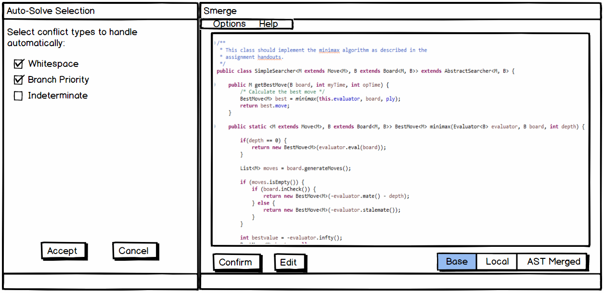

# User Manual
Smerge is a tool used for automating and minimizing user input in merge conflict resolutions.
## Installation
* Clone the *smerge* repository to ~/.
* Update your `.gitconfig` to include: 
```bash
[mergetool "smerge"]
        cmd = java -jar ~/smerge/Merger.jar \$BASE \$LOCAL \$REMOTE \$MERGED
[merge]
        tool = smerge
```

## Usage
You may run *smerge* as a [git mergetool](https://git-scm.com/docs/git-mergetool) through the following command:

`git mergetool --tool=smerge <conflicting file>`

If the merge conflict cannot be automatically resolved, a GUI will open for manually resolving the conflict.

## GUI Usage
This is what the GUI will look like after running our tool in the command line.



To disable the GUI from automatically launching, users can add the option `-g` to the command. This will tell the tool to try to completely automatically merge the two files. If it runs into any non-trivial errors, however, it will fail silently.

**GUI Functions:**
* **Options Tab:** Opens the Auto-Solve Selection menu
* **Help Tab:** Opens the User Manual within the tool
* **Auto-Solve Selection Menu:** Allows user to specify the types of conflicts they would like the tool to automatically handle. For example, if Whitespace is selected, the tool will handle all whitespace conflicts automatically.
* **Confirm Button:** Allows user to 'confirm' changes made by the automated merge
* **Edit Button:** In the case of non-trivial merge conflicts, allows the user to edit the code to resolve them manually.
* **Base Button:** Switches the display to show the Base file given to the tool
* **Local Button:** Switches the display to show the Local file (user's changes) given to the tool
* **Remote Button:** Switches the display to show the Remote file (other user's changes) given to the tool
* **AST Merged Button:** If possible, shows the result of the fully automated merge using ASTs

## Example
```
// Common ancestor (Base):
public static ArrayList doSomething(length) {
  ArrayList arr = new ArrayList();
  for (int i = 0; i < length; i++) {
    arr.add(i);
  }
  return arr;
}
```

Note the white space:
```
// Yours (Local):
public static ArrayList doSomething(length) {
  ArrayList arr = new ArrayList();
  for (int i = 0; i < length; i++) {
    arr.add(i);
  }

  return arr;
}
```

Note the white space on different line:
```
// Theirs (Remote)
public static ArrayList doSomething(length) {
  ArrayList arr = new ArrayList();
  
  for (int i = 0; i < length; i++) {
    arr.add(i);
  }
  return arr;
}
```

Conflict resolution after using Smerge
```
// Final (AST Merged)
public static ArrayList doSomething(length) {
  ArrayList arr = new ArrayList();
  
  for (int i = 0; i < length; i++) {
    arr.add(i);
  }
  
  return arr;
}
```
Following this, the GUI will display the final resolution on the main window and prompt the user to accept the changes made unless if the `-g` option was declared in the initial command.
