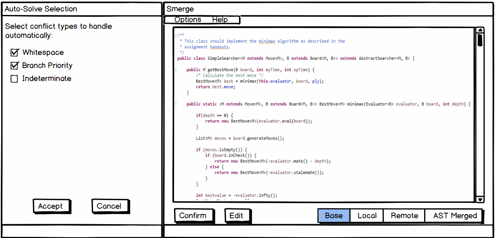

[]
`
# User Manual
Smerge is a merge tool that resolves merge conflicts with abstract syntax trees (ASTs). By parsing the source code into ASTs, Smerge is able to automatically resolve false conflicts (conflicts where the differences are purely cosmetic; e.g. variable names or whitespace), as well as provide an intuitive tree-based candidate resolution for conflicts with structural differences in the source code.

## Abstract Syntax Tree Merging
Once Smerge generates the ASTs, it checks where the conflict is located in the tree. If the trees are identical, then the differences are cosmetic and the conflict is a false conflict. False conflicts are resolved by choosing the changes from the newer branch. If the differences are in separate subtrees, the conflict can be resolved by performing a tree merge on the ASTs.

If the differences occur in the same subtree, then the conflict involves overlapping structural differences. In this case, Smerge uses several heuristics to produce a candidate merge, but the final resolution is left up to the developer.

## Installation
* Clone the *smerge* repository to ~/.
* Update your `.gitconfig` to include: 
```bash
[mergetool "smerge"]
        cmd = java -jar ~/smerge/Merger.jar \$BASE \$LOCAL \$REMOTE \$MERGED
[merge]
        tool = smerge
```

## Usage
You may run *smerge* as a [git mergetool](https://git-scm.com/docs/git-mergetool) through the following command:

`git mergetool --tool=smerge <conflicting file>`

If the merge conflict cannot be automatically resolved, a GUI will open for manually resolving the conflict.

## GUI Usage
This is what the GUI will look like after running our tool in the command line.



When ran, the GUI serves as a platform to communicate with the user. The main window will display the input code that is currently selected. If the tool is able to fully automate the merge, then the user will be prompted to confirm any changes made. Otherwise, the tool will have run into a non-trivial conflict. In that case, the user will be prompted to edit the code base and manually resolve the conflict. After all conflicts are resolved and confirmed, the GUI will close and provide the user with the merged file.

**GUI Functions:**
* **Options Tab:** Opens the Auto-Solve Selection menu
* **Help Tab:** Opens the User Manual within the tool
* **Auto-Solve Selection Menu:** Allows user to specify the types of conflicts they would like the tool to automatically handle. For example, if Whitespace is selected, the tool will handle all whitespace conflicts automatically.
* **Confirm Button:** Allows user to 'confirm' changes made by the automated merge
* **Edit Button:** In the case of non-trivial merge conflicts, allows the user to edit the code to resolve them manually.
* **Base Button:** Switches the display to show the Base file given to the tool
* **Local Button:** Switches the display to show the Local file (user's changes) given to the tool
* **Remote Button:** Switches the display to show the Remote file (other user's changes) given to the tool
* **AST Merged Button:** If possible, shows the result of the fully automated merge using ASTs

## Example
```
// Common ancestor (Base):
public static ArrayList doSomething(length) {
  ArrayList arr = new ArrayList();
  for (int i = 0; i < length; i++) {
    arr.add(i);
  }
  return arr;
}
```

Note the white space:
```
// Yours (Local):
public static ArrayList doSomething(length) {
  ArrayList arr = new ArrayList();
  for (int i = 0; i < length; i++) {
    arr.add(i);
  }

  return arr;
}
```

Note the white space on different line:
```
// Theirs (Remote)
public static ArrayList doSomething(length) {
  ArrayList arr = new ArrayList();
  
  for (int i = 0; i < length; i++) {
    arr.add(i);
  }
  return arr;
}
```

Conflict resolution after using Smerge:
```
// Final (AST Merged)
public static ArrayList doSomething(length) {
  ArrayList arr = new ArrayList();
  
  for (int i = 0; i < length; i++) {
    arr.add(i);
  }
  
  return arr;
}
```
Following this, the GUI will display the final resolution on the main window and prompt the user to accept the changes made.
